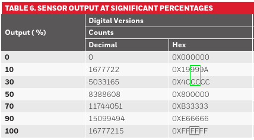
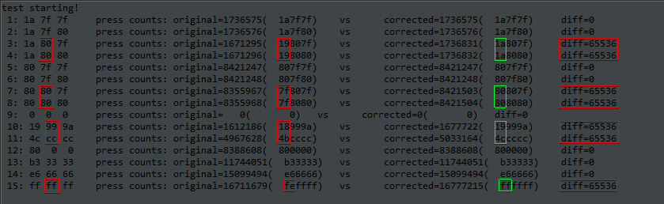
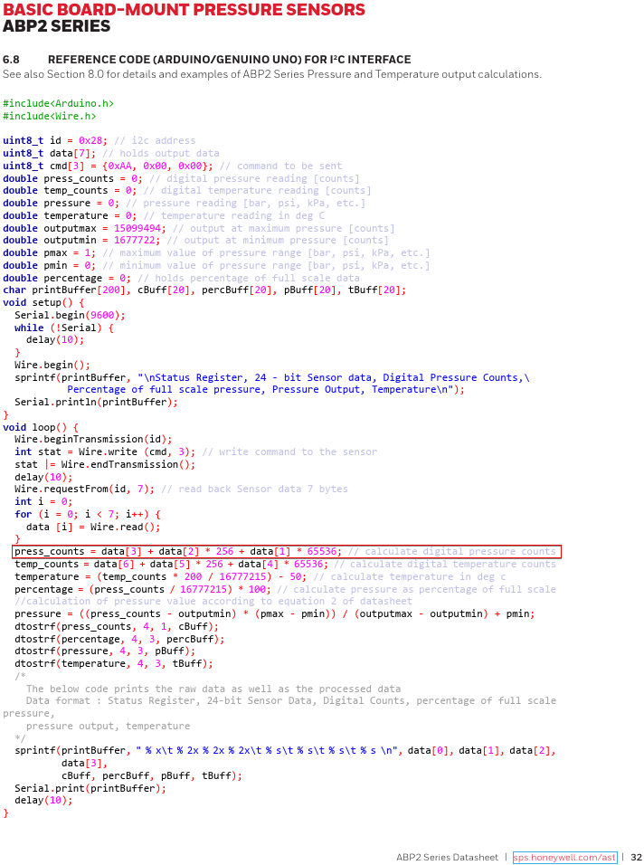

# test_ABP2_specs
Arduino test code for ABP2 press_counts formula given in sensor specification document.

Original specs doc from [ABP2 Series data sheet](https://prod-edam.honeywell.com/content/dam/honeywell-edam/sps/siot/en-us/products/sensors/pressure-sensors/board-mount-pressure-sensors/basic-abp2-series/documents/sps-siot-abp2-series-datasheet-32350268-en.pdf?download=false) has a hex to dec table which shows expected bytes:

The same specs also give an I2C example where a pressure counts formula is given, but which fails when the middle data byte is greater than 0x7F, as this Arduino exampel test proves:

reason being that the middle byte is interpreted as negative which leads to a 65536 difference!

Screenshot with the original formula:

